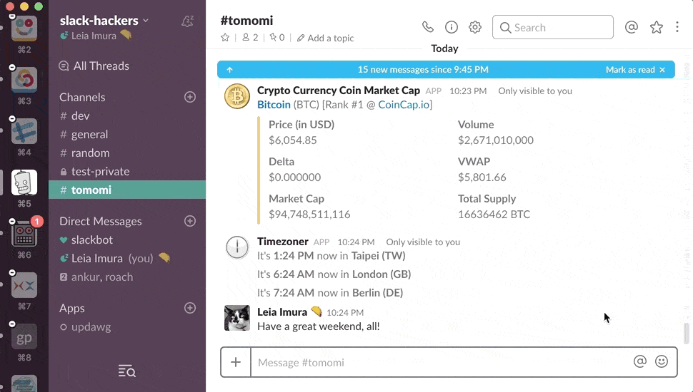

# Reacjilator for Slack

Reacjilator は Slack 用のボットで、ユーザからのリアクション絵文字（「リアク字」）に反応してそのリアクションのあったメッセージを翻訳します。たとえば英語のメッセージにたいして `:flag-jp:` のリアク字がつけられると即時にそのメッセージの日本語の翻訳がスレッドに表示されます。




## Host Your Own & Run the Bot on Your Slack Workspace

### Slack App セットアップ

1. [api.slack.com/apps?new_app=1](https://api.slack.com/apps?new_app=1): でアプリを作成
2. Event Subscription をオンにする。必要なイベントは `reaction_added` で Request URL は `https://自前のサーバ.com/events` へポイントする
3. Bot user をオンにする。この際に適当な名前もつける
4. OAuth & Permission から必要な Scopes を加える:
  - `chat:write:bot` (chat.postMessage メソッドでボットからメッセージを送るためのパーミッション),
  - `reactions:read` (絵文字リアクションにアクセス)
  - `channels:read` (チャンネルの read アクセス)
  - `channels:history` (チャンネルメッセージへのアクセス)
  - ほかにも `mpim.history` などの `*.history` スコープをオンにすると、DM などのプライベートメッセージでボットを動かすことができます。


### サーバへのデプロイ

まず `.env_test` ファイルネームを `.env` に書き換え、必要な認証キーなどの情報を入力してください。

```
SLACK_CLIENT_ID=
SLACK_CLIENT_SECRET=
SLACK_VERIFICATION_TOKEN=
SLACK_AUTH_TOKEN=
GOOGLE_PROJECT_ID=
GOOGLE_KEY=
```

Slack の認証キーなどは `https://api.slack.com/apps/[YOUR_APP_ID]/general` の **Basic Information** から、 auth token は **OAuth & Permissions** から。

翻訳の API で使う、Google Cloud project ID と API も自前で準備してください。 [cloud.google.com/translate/docs/getting-started](https://cloud.google.com/translate/docs/getting-started)

もしくは、下の Heroku ボタンを使って Heroku サーバにデプロイするのならば、`.env` ファイルを使わず、フォームに入力することによってそのままでブロイ可能です。 

[](https://heroku.com/deploy?template=https://github.com/slackAPI/reacjilator)
